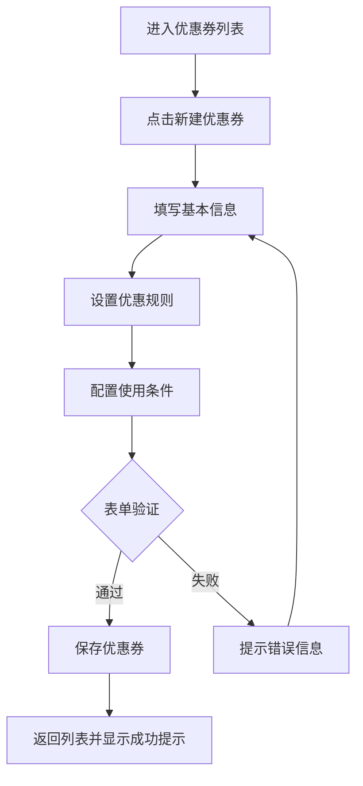
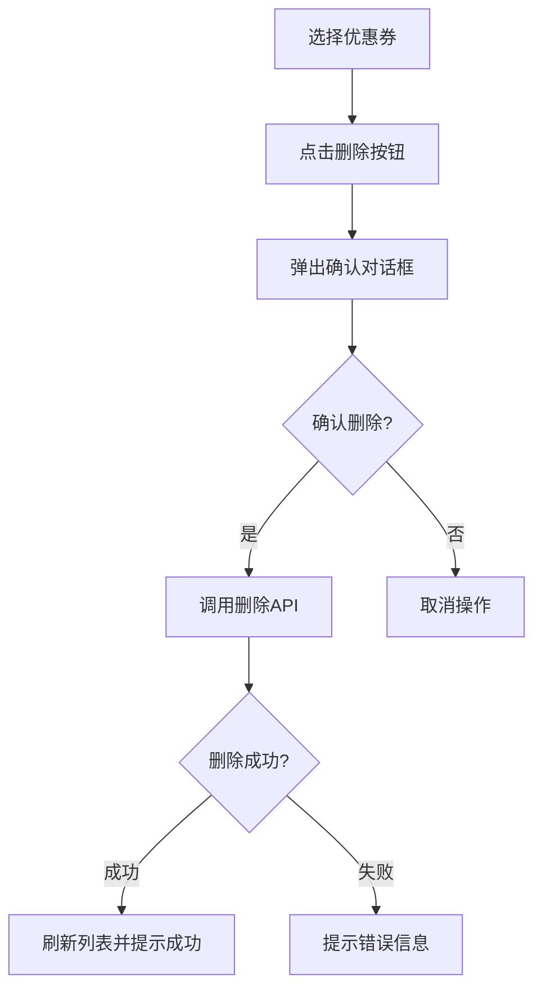

# 门店优惠券管理系统 - 产品需求文档

## 1. 产品概述

门店优惠券管理系统是一个面向门店管理员的后台管理工具，用于创建、编辑和删除门店优惠券。系统支持设置优惠券的基本信息、优惠规则和使用条件，帮助门店提升营销效率和客户转化率。

主要功能包括优惠券的新建、编辑、删除、批量操作以及状态管理。目标用户为门店管理员，通过简洁直观的界面快速管理优惠券业务。

## 2. 核心功能

### 2.1 用户角色

| 角色 | 说明 | 核心权限 |
|------|------|---------|
| 门店管理员 | 管理门店优惠券 | 创建、编辑、删除、启用/禁用优惠券 |

### 2.2 功能模块

1. **优惠券列表页面**: 展示所有优惠券，支持筛选、搜索和批量操作
2. **新建优惠券**: 表单式创建优惠券，设置基本信息、优惠规则、使用条件
3. **编辑优惠券**: 修改现有优惠券信息
4. **删除优惠券**: 删除单个或批量删除优惠券
5. **优惠券详情**: 查看优惠券完整信息

### 2.3 页面详情

| 页面名称 | 模块名称 | 功能描述 |
|---------|---------|---------|
| 优惠券列表 | 搜索筛选区 | 支持按名称、状态、时间范围筛选 |
| 优惠券列表 | 数据表格 | 展示优惠券列表，支持排序、分页 |
| 优惠券列表 | 批量操作栏 | 批量启用/禁用/删除优惠券 |
| 新建优惠券 | 基本信息表单 | 优惠券名称、类型、有效期 |
| 新建优惠券 | 优惠规则设置 | 满减金额、折扣比例、优惠上限 |
| 新建优惠券 | 使用条件设置 | 最低消费、适用范围、限领数量 |
| 编辑优惠券 | 表单编辑 | 修改所有可编辑字段 |
| 删除确认 | 确认对话框 | 单个或批量删除确认 |

## 3. 核心流程

### 3.1 新建优惠券流程



### 3.2 删除优惠券流程



## 4. 用户界面设计

### 4.1 设计风格

- **设计理念**: 现代商务风格，简洁高效，强调数据可视化
- **主色调**: #1890ff (品牌蓝)，辅助色 #52c41a (成功绿)、#ff4d4f (警告红)
- **按钮样式**: 圆角按钮，主按钮带阴影，hover 有微动效果
- **字体**: 标题使用中等粗体，正文使用常规字重，数字使用等宽字体
- **布局**: 左侧导航 + 右侧内容区，卡片式设计，信息层次分明
- **图标**: 使用线性图标，风格统一

### 4.2 页面设计概览

| 页面 | 模块 | UI元素 |
|------|------|--------|
| 优惠券列表 | 顶部操作栏 | 新建按钮、主搜索框、状态筛选 |
| 优惠券列表 | 数据表格 | 复选框、优惠券名称、类型标签、面值、状态、时间、操作按钮 |
| 优惠券列表 | 底部分页 | 总数显示、每页条数、翻页控件 |
| 新建优惠券 | 表单区域 | 输入框、选择器、日期范围选择器、数值输入 |
| 新建优惠券 | 底部操作栏 | 取消按钮、提交按钮 |

### 4.3 响应式设计

- **桌面端**: 最佳体验，完整展示所有功能
- **平板端**: 自适应布局，保持核心功能可用
- **移动端**: 简化导航，优先展示关键操作

## 5. 数据结构

### 5.1 优惠券数据模型

```json
{
  "id": "唯一标识符",
  "name": "优惠券名称",
  "type": "优惠券类型: 满减券/折扣券",
  "value": "优惠金额或折扣比例",
  "minAmount": "最低消费金额",
  "maxDiscount": "最大优惠金额",
  "totalCount": "总发行数量",
  "remainCount": "剩余数量",
  "perUserLimit": "每人限领数量",
  "startTime": "开始时间",
  "endTime": "结束时间",
  "status": "状态: 草稿/待生效/生效中/已失效",
  "description": "使用说明",
  "createTime": "创建时间",
  "updateTime": "更新时间"
}
```

## 6. 性能要求

- 页面加载时间 < 2秒
- 表格数据渲染 < 500ms
- 表单提交响应 < 1秒
- 支持 1000+ 优惠券数据展示
