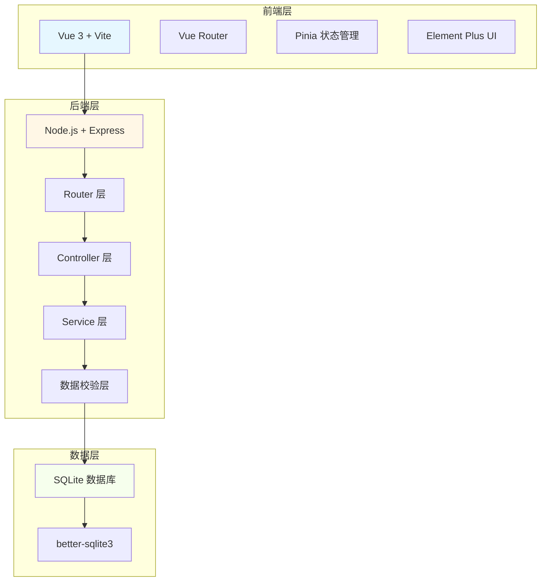
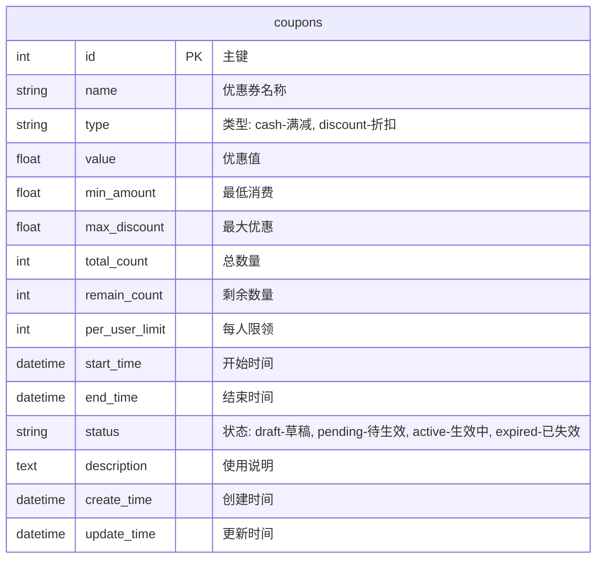

# 门店优惠券管理系统 - 技术架构文档

## 1. 架构设计



## 2. 技术栈说明

### 2.1 前端技术

- **框架**: Vue 3 (Composition API)
- **构建工具**: Vite
- **路由**: Vue Router 4
- **状态管理**: Pinia
- **UI 组件库**: Element Plus
- **HTTP 客户端**: Axios
- **样式**: SCSS + CSS Variables

### 2.2 后端技术

- **运行环境**: Node.js 18+
- **框架**: Express 4
- **数据库**: SQLite (轻量级，无需额外安装)
- **ORM**: better-sqlite3 (高性能同步数据库)
- **数据校验**: express-validator
- **跨域处理**: cors 中间件

## 3. 路由定义

### 3.1 前端路由

| 路由路径 | 页面名称 | 说明 |
|---------|---------|------|
| / | 重定向到 /coupons | 首页重定向 |
| /coupons | 优惠券列表 | 展示和管理优惠券 |
| /coupons/new | 新建优惠券 | 创建优惠券表单 |
| /coupons/:id/edit | 编辑优惠券 | 修改优惠券信息 |

### 3.2 后端 API

| 方法 | 路由 | 说明 |
|------|------|------|
| GET | /api/coupons | 获取优惠券列表 |
| GET | /api/coupons/:id | 获取单个优惠券详情 |
| POST | /api/coupons | 创建新优惠券 |
| PUT | /api/coupons/:id | 更新优惠券 |
| DELETE | /api/coupons/:id | 删除单个优惠券 |
| DELETE | /api/coupons | 批量删除优惠券 |

## 4. API 详细定义

### 4.1 获取优惠券列表

**请求**
```
GET /api/coupons
```

**查询参数**
| 参数名 | 类型 | 必填 | 说明 |
|-------|------|------|------|
| page | number | 否 | 页码，默认 1 |
| pageSize | number | 否 | 每页条数，默认 10 |
| keyword | string | 否 | 搜索关键词 |
| status | string | 否 | 状态筛选 |

**响应**
```json
{
  "code": 200,
  "message": "success",
  "data": {
    "list": [...],
    "pagination": {
      "page": 1,
      "pageSize": 10,
      "total": 100
    }
  }
}
```

### 4.2 创建优惠券

**请求**
```
POST /api/coupons
Content-Type: application/json
```

**请求体**
```json
{
  "name": "新人专享券",
  "type": "cash",
  "value": 20,
  "minAmount": 100,
  "maxDiscount": 50,
  "totalCount": 1000,
  "perUserLimit": 1,
  "startTime": "2026-06-20T00:00:00Z",
  "endTime": "2026-07-20T23:59:59Z",
  "description": "全场满100可用"
}
```

**响应**
```json
{
  "code": 200,
  "message": "优惠券创建成功",
  "data": {
    "id": 1
  }
}
```

### 4.3 更新优惠券

**请求**
```
PUT /api/coupons/:id
Content-Type: application/json
```

**请求体**
```json
{
  "name": "修改后的优惠券名称",
  "value": 30
}
```

**响应**
```json
{
  "code": 200,
  "message": "优惠券更新成功",
  "data": null
}
```

### 4.4 删除优惠券

**请求**
```
DELETE /api/coupons/:id
```

或批量删除
```
DELETE /api/coupons
Content-Type: application/json

{
  "ids": [1, 2, 3]
}
```

**响应**
```json
{
  "code": 200,
  "message": "删除成功",
  "data": null
}
```

## 5. 数据模型

### 5.1 优惠券表 (coupons)



### 5.2 数据定义语言 (DDL)

```sql
CREATE TABLE IF NOT EXISTS coupons (
  id INTEGER PRIMARY KEY AUTOINCREMENT,
  name VARCHAR(100) NOT NULL,
  type VARCHAR(20) NOT NULL DEFAULT 'cash',
  value DECIMAL(10, 2) NOT NULL,
  min_amount DECIMAL(10, 2) DEFAULT 0,
  max_discount DECIMAL(10, 2) DEFAULT NULL,
  total_count INTEGER NOT NULL DEFAULT 0,
  remain_count INTEGER NOT NULL DEFAULT 0,
  per_user_limit INTEGER DEFAULT 1,
  start_time DATETIME NOT NULL,
  end_time DATETIME NOT NULL,
  status VARCHAR(20) NOT NULL DEFAULT 'draft',
  description TEXT,
  create_time DATETIME DEFAULT CURRENT_TIMESTAMP,
  update_time DATETIME DEFAULT CURRENT_TIMESTAMP
);

CREATE INDEX idx_coupons_status ON coupons(status);
CREATE INDEX idx_coupons_end_time ON coupons(end_time);
```

## 6. 目录结构

```
/门店优惠券管理系统
├── frontend/                 # 前端项目
│   ├── src/
│   │   ├── api/             # API 调用
│   │   ├── components/      # 公共组件
│   │   ├── pages/            # 页面组件
│   │   ├── stores/           # Pinia 状态管理
│   │   ├── router/           # 路由配置
│   │   ├── styles/           # 全局样式
│   │   ├── utils/            # 工具函数
│   │   ├── App.vue
│   │   └── main.js
│   ├── index.html
│   ├── vite.config.js
│   └── package.json
│
├── backend/                  # 后端项目
│   ├── src/
│   │   ├── routes/          # 路由定义
│   │   ├── controllers/      # 控制器
│   │   ├── services/         # 业务逻辑
│   │   ├── models/           # 数据模型
│   │   ├── middleware/       # 中间件
│   │   ├── database/         # 数据库配置
│   │   └── utils/            # 工具函数
│   ├── server.js             # 入口文件
│   ├── package.json
│   └── database.sqlite
│
├── package.json              # 根目录 package.json
└── README.md
```

## 7. 开发规范

### 7.1 代码规范

- 使用 ESLint + Prettier 统一代码风格
- Vue 组件使用 Composition API
- API 请求统一封装在 api 模块
- 状态管理使用 Pinia
- CSS 使用 BEM 命名规范

### 7.2 Git 提交规范

```
feat: 新功能
fix: 修复 bug
docs: 文档更新
style: 代码格式
refactor: 重构
test: 测试相关
chore: 构建或辅助工具
```
